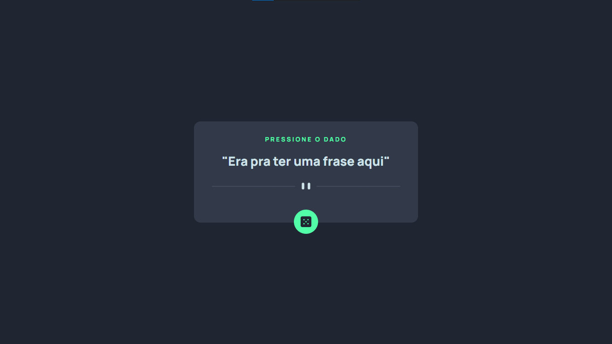

# Frontend Mentor - Advice generator app

O que usei para completar o desafio:
- Semantic HTML5 markup
- Flexbox
- Javascript
- API (<a style="color: white;" href="https://api.adviceslip.com/" target="_blank"> Advice Slip </a>)

### Considerações/Aprendizados:
Depois de algumas tentativas até que não foi tão complexo consumir essa API.É muito bom quando você consegue retirar um resultado depois de algumas horas trabalhando no projeto.

Conseguiu habilitar um setTimeOut(primeira vez sozinho haha) para que o usuário não faça várias requisições, já que a API gera um novo advice a cada 2 segundos.

(Está em inglês, mas acredito que seu navegador dá conta de traduzir kk)
## Resultado do projeto:
